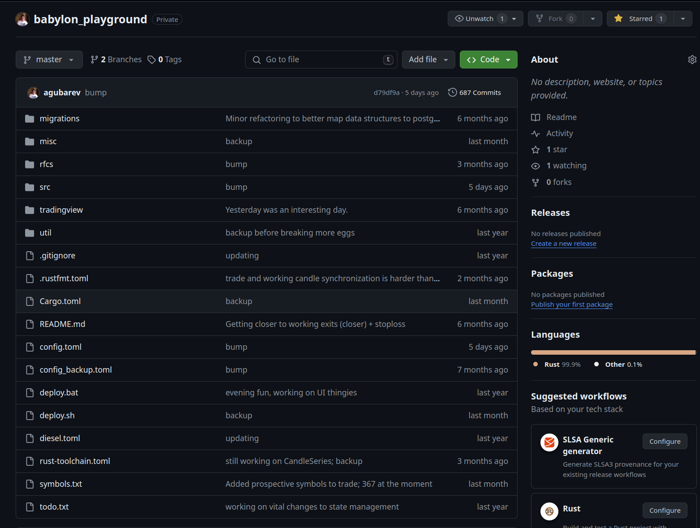
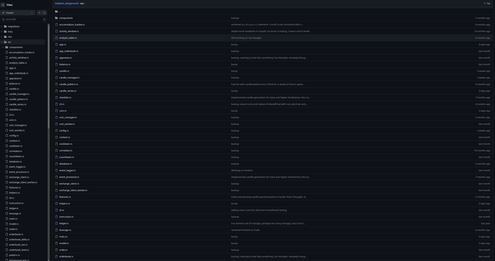

## Description

This repository is a stripped-down version of my other repository, `babylon_playground`, used primarily for prototyping,
simulation, and generally having fun exploring different mechanisms useful for a trading system. It is a playful draft,
serving as an incubator for some ideas and concepts I have been developing since early 2021. The code is written
entirely in Rust and is part of my ongoing personal hobby project to develop a trading system for the cryptocurrency
market, named Babylon. While the core of the codebase is copied *AS IS* from the playground repository: git history,
sensitive information, security credentials, some components, and dependency crates have been selectively excluded.

## Purpose

The purpose of this repository made public is to display my coding work and provide insight into my approach to
structuring and writing code in general. It is a window into the creative process behind developing functional
algorithms in the field of cryptocurrency trading.

## Important Note

The code in this repository depends on two customized Rust crates that are not available for this demonstration, which
means it will not run as provided. Additionally, the conceptual logic and technical approach implemented here is
entirely self-derived from independent research and trial-and-error. This repository is not meant to offer canonical
solutions but rather to share my personal journey in algorithmic trading.

## A glance at the `babylon_playground` repository

Front page:

Some files:

First commits:
